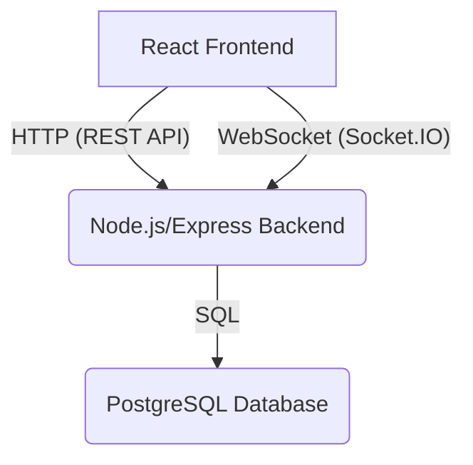

# Gemini Project Overview

This document provides a comprehensive overview of the "Save Together, Buy Smarter" bulk purchasing application. It is intended for new developers joining the team.

## Project Overview

This project is a full-stack bulk purchasing application that allows users to form groups to buy products in bulk at a discounted price. The application includes features like user authentication, product catalogs, group management, order processing, an escrow system to ensure secure transactions, and a real-time chat system.

The project has a React frontend and a Node.js/Express backend with a PostgreSQL database. It has evolved from a frontend-only prototype with mock data. Initially, the backend logic resided within a `server` folder inside `src`, but it has since been moved and renamed to a top-level `backend` folder, becoming a full-fledged application with a real backend and an integrated chat system. Key developments include fixing `auth_token` persistence issues and refactoring CORS middleware.

## Architecture

The application follows a classic client-server architecture with real-time capabilities:

-   **Frontend**: A single-page application (SPA) built with **React** and **TypeScript**. It uses `vite` as a build tool and `shadcn/ui` for UI components. It interacts with the backend via RESTful API calls and real-time Socket.IO events.
-   **Backend**: A RESTful API built with **Node.js** and **Express**. It handles business logic, authentication, and serves as a Socket.IO server for real-time communication.
-   **Database**: A **PostgreSQL** database to store all application data, including chat history.

The frontend communicates with the backend via RESTful API calls for data retrieval and manipulation. Specifically for the real-time chat system, it extensively leverages **Socket.IO** for features like instant messaging, typing indicators, and online status updates. Authentication is handled using JSON Web Tokens (JWT).



## Getting Started

To get the project up and running, follow these steps:

1.  **Clone the repository.**
2.  **Set up the backend:**
    -   Navigate to the `backend` directory.
    -   Install dependencies: `npm install`
    -   Start the PostgreSQL database using Docker (if not already running): `docker-compose up -d`
    -   Run database migrations: `npm run migrate`
    -   Seed the database with sample data: `npm run seed`
    -   Start the backend server: `npm run dev`
    -   The backend will be running at `http://localhost:3000`.

3.  **Set up the frontend:**
    -   Navigate to the root directory.
    -   Install dependencies: `npm i`
    -   Start the development server: `npm run dev`
    -   The frontend will be running at `http://localhost:5173`.

## Authentication

The application uses JWT-based authentication with role-based access control (RBAC). The backend provides endpoints for user signup and login. Upon successful authentication, the server issues a JWT, which the frontend stores in `localStorage` along with the user's ID. This token is then included in the `Authorization` header for all subsequent RESTful API requests and used for Socket.IO authentication.

The application supports four user roles:

-   **superUser**: Full system access.
-   **admin**: Can manage users and content.
-   **vendor**: Can manage products and orders.
-   **member**: Standard user role.

## Chat System

The project includes a comprehensive real-time chat system with a "transparency-first" model. It supports two main types of conversations:

1.  **Group Internal Chat**:
    -   Purpose: Members of a purchasing group chat among themselves to coordinate and discuss.
    -   Participants: All group members can read and send messages.
    -   Auto-creation: An internal chat is automatically created when a group is formed.
    -   Auto-add members: Members are automatically added to the internal chat when they join the group.

2.  **Group-Vendor Chat**:
    -   Purpose: The group admin negotiates with a vendor on behalf of the entire group.
    -   Participants: Only the group admin can send messages to the vendor. All other group members can read the conversation (full transparency). The vendor can send messages.
    -   Creation: Created on-demand by the group admin when contacting a vendor.

Key features of the chat system include:
-   Real-time messaging with Socket.IO
-   Typing indicators
-   Read receipts
-   Online/offline status for users
-   Unread message counts
-   Message deletion (soft delete)
-   Role-based permissions for sending messages in group-vendor chats

## API

The backend provides a comprehensive RESTful API. In addition to the core features, it includes dedicated endpoints for the chat system. The API is well-documented in the `backend/README.md`, `backend/API_EXAMPLES.md`, and `src/CHAT_BACKEND_SETUP.md` files.

Some key API endpoint categories include:

-   **Auth**: `/api/auth/login`, `/api/auth/signup`, `/api/auth/me`
-   **Users**: CRUD operations, role management, statistics.
-   **Products**: Catalog, categories, vendor products.
-   **Vendors**: Dashboard, stats, orders, customers.
-   **Orders**: Create, view, update status.
-   **Escrow**: Transactions, release funds, confirm delivery.
-   **Chat**: Conversations, messages, typing indicators, unread counts.

## Database

The PostgreSQL database is the backbone of the application, storing all persistent data. The schema is defined across two main files: `backend/db/schema.sql` for core entities and `backend/migrations/006_create_chat_tables.sql` for the chat system.

Here is a diagram of the combined database schema:

```mermaid
erDiagram
    users {
        UUID id PK
        VARCHAR email UNIQUE
        VARCHAR password_hash
        VARCHAR name
        VARCHAR role
        TEXT avatar
        UUID vendor_id FK "REFERENCES vendors(id) if role is vendor"
        TIMESTAMP created_at
        BOOLEAN is_active
        INTEGER trust_score
        BOOLEAN is_online
    }

    vendors {
        UUID id PK
        VARCHAR name
        DECIMAL rating
        VARCHAR location
        TEXT image
        BOOLEAN verified
        TIMESTAMP created_at
    }

    products {
        UUID id PK
        VARCHAR name
        VARCHAR image
        DECIMAL bulk_price
        DECIMAL retail_price
        INTEGER moq
        UUID vendor_id FK REFERENCES vendors(id)
        VARCHAR category
        TIMESTAMP created_at
        BOOLEAN is_active
    }

    groups {
        UUID id PK
        VARCHAR name
        TEXT description
        VARCHAR join_code UNIQUE
        INTEGER moq_target
        INTEGER current_quantity
        VARCHAR status
        UUID created_by FK REFERENCES users(id)
        TIMESTAMP created_at
    }

    group_members {
        UUID id PK
        UUID group_id FK REFERENCES groups(id)
        UUID user_id FK REFERENCES users(id)
        VARCHAR role
        TIMESTAMP joined_at
    }

    orders {
        UUID id PK
        VARCHAR order_number UNIQUE
        UUID group_id FK REFERENCES groups(id)
        UUID buyer_id FK REFERENCES users(id)
        VARCHAR status
        DECIMAL total_amount
        TIMESTAMP created_at
        TIMESTAMP estimated_delivery
    }

    order_items {
        UUID id PK
        UUID order_id FK REFERENCES orders(id)
        UUID product_id FK REFERENCES products(id)
        INTEGER quantity
        DECIMAL price
        TIMESTAMP created_at
    }

    escrow_transactions {
        UUID id PK
        VARCHAR transaction_number UNIQUE
        UUID order_id FK REFERENCES orders(id)
        UUID buyer_id FK REFERENCES users(id)
        UUID seller_id FK REFERENCES users(id)
        DECIMAL amount
        DECIMAL escrow_fee
        VARCHAR status
        TIMESTAMP created_at
        TIMESTAMP paid_at
        TIMESTAMP shipped_at
        TIMESTAMP delivered_at
        TIMESTAMP inspection_deadline
        TIMESTAMP auto_release_at
        TIMESTAMP released_at
        VARCHAR tracking_id
        VARCHAR courier
    }

    disputes {
        UUID id PK
        VARCHAR dispute_number UNIQUE
        UUID transaction_id FK REFERENCES escrow_transactions(id)
        VARCHAR reason
        VARCHAR status
        VARCHAR resolution
        TIMESTAMP created_at
        TIMESTAMP resolved_at
        TEXT admin_notes
    }

    dispute_evidence {
        UUID id PK
        UUID dispute_id FK REFERENCES disputes(id)
        VARCHAR uploaded_by
        VARCHAR type
        TEXT url
        TEXT description
        TIMESTAMP created_at
    }

    trust_scores {
        UUID id PK
        UUID user_id UNIQUE FK REFERENCES users(id)
        INTEGER score
        INTEGER completed_transactions
        INTEGER total_transactions
        DECIMAL dispute_rate
        DECIMAL buyer_rating
        DECIMAL seller_rating
        BOOLEAN id_verified
        BOOLEAN business_verified
        BOOLEAN email_verified
        BOOLEAN phone_verified
        TIMESTAMP updated_at
    }

    conversations {
        UUID id PK
        VARCHAR type
        VARCHAR title
        VARCHAR avatar
        UUID group_id FK REFERENCES groups(id)
        UUID vendor_id FK REFERENCES users(id)
        UUID product_id FK REFERENCES products(id)
        TIMESTAMP created_at
        TIMESTAMP updated_at
    }

    conversation_participants {
        UUID id PK
        UUID conversation_id FK REFERENCES conversations(id)
        UUID user_id FK REFERENCES users(id)
        VARCHAR role
        BOOLEAN can_send
        TIMESTAMP joined_at
        TIMESTAMP last_read_at
    }

    messages {
        UUID id PK
        UUID conversation_id FK REFERENCES conversations(id)
        UUID sender_id FK REFERENCES users(id)
        TEXT content
        TIMESTAMP created_at
        TIMESTAMP updated_at
        BOOLEAN is_deleted
    }

    typing_indicators {
        UUID id PK
        UUID conversation_id FK REFERENCES conversations(id)
        UUID user_id FK REFERENCES users(id)
        TIMESTAMP started_at
        TIMESTAMP expires_at
    }

    message_read_receipts {
        UUID id PK
        UUID message_id FK REFERENCES messages(id)
        UUID user_id FK REFERENCES users(id)
        TIMESTAMP read_at
    }

    users ||--o{ group_members : "participates in"
    users ||--o{ groups : "created by"
    users ||--o{ orders : "places"
    users ||--o{ escrow_transactions : "initiates"
    users ||--o{ escrow_transactions : "sells through"
    users ||--o{ trust_scores : "has"
    users ||--o{ conversation_participants : "participates in"
    users ||--o{ messages : "sends"
    users ||--o{ typing_indicators : "indicates typing"
    users ||--o{ message_read_receipts : "reads"

    vendors ||--o{ products : "offers"
    
    groups ||--o{ group_members : "has"
    groups ||--o{ orders : "is associated with"
    groups ||--o{ conversations : "has"

    products ||--o{ order_items : "is part of"
    products ||--o{ conversations : "is discussed in"
    
    orders ||--o{ order_items : "contains"
    orders ||--o{ escrow_transactions : "involves"

    escrow_transactions ||--o{ disputes : "has"

    disputes ||--o{ dispute_evidence : "has"

    conversations ||--o{ conversation_participants : "has"
    conversations ||--o{ messages : "contains"
    conversations ||--o{ typing_indicators : "has"
    
    messages ||--o{ message_read_receipts : "has"

```

## Frontend

The frontend is a React application built with TypeScript and Vite. It uses `shadcn/ui` for components, and `tailwindcss` for styling. The code is organized into components, contexts, and library files.

-   **`src/components`**: Contains all the React components, organized by feature (e.g., `admin`, `auth`, `chat`, `escrow`, `products`, `vendor`).
-   **`src/contexts`**: Contains React contexts, such as `AuthContext` for managing authentication state.
-   **`src/lib`**: Contains library code, such as the `api.ts` client for RESTful calls, `chatApi.ts` for chat-specific REST, `chatSocket.ts` for Socket.IO client, and type definitions.
-   **`src/hooks`**: Contains custom React hooks, notably `useChat.ts` for managing chat state and real-time updates.

The `src/FRONTEND_INTEGRATION_GUIDE.md` and `src/CHAT_UX_FLOW.md` files provide detailed instructions on how to integrate the frontend with the backend and how the chat system's UI/UX is designed.

## Key Files

-   **`backend/server.js`**: The main entry point for the backend server, including Socket.IO setup.
-   **`backend/db/schema.sql`**: The core database schema.
-   **`backend/migrations/006_create_chat_tables.sql`**: Database schema and triggers for the chat system.
-   **`backend/routes/*.js`**: The RESTful API route definitions.
-   **`backend/controllers/chat.controller.js`**: Business logic for chat operations.
-   **`backend/socket/chat.socket.js`**: Socket.IO event handlers for real-time chat.
-   **`src/App.tsx`**: The root component of the React application.
-   **`src/contexts/AuthContext.tsx`**: The authentication context for the frontend.
-   **`src/lib/api.ts`**: The general API client for the frontend.
-   **`src/lib/socket/chatSocket.ts`**: The Socket.IO client wrapper for the frontend.
-   **`src/hooks/useChat.ts`**: Custom React hook for chat functionality.
-   **`src/components/chat/ChatDashboardReal.tsx`**: Frontend component for displaying conversation lists.
-   **`src/components/chat/ChatWindowReal.tsx`**: Frontend component for the chat message interface.
-   **`gemini.md`**: This file, providing a comprehensive project overview.
-   **`*.md`**: Various other markdown files providing detailed documentation on different aspects of the project.

## Agent Operational Guidelines

To ensure safe, efficient, and high-quality contributions, the agent will adhere to the following operational guidelines:

-   **Always Make Plans**: Before making any changes or proceeding with implementation, the agent will clearly articulate its plan to the user, outlining the steps it intends to take and the rationale behind them.
-   **Test Before Implementation**: When adding new features or fixing bugs, the agent will prioritize creating appropriate test files. It will ensure that these tests are passing and correctly validate the intended changes before proceeding with the main implementation.
-   **Retrace for Recurring Errors**: If a recurring error is encountered or the agent finds itself stuck, it will retrace its previous solutions and assumptions. The agent will take time to re-evaluate the problem, think through alternative solutions, and avoid rushing into new attempts without careful consideration.
-   **Thoughtful Suggestions**: All suggestions and proposed solutions will be thoroughly thought through, considering potential impacts and alternatives, before being presented to the user.
